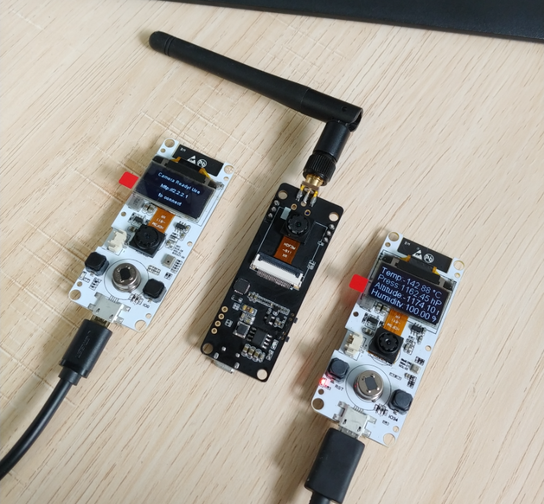

TTGO-Camera-Jeedom-API
=====================

Cette version du firmware de la TTGO camera (https://github.com/Xinyuan-LilyGO) n'inclus que la caméra et le détecteur de mouvement, les boutons et l'écran ont été retirés. À cela, on ajoute un support de l'API Web de Jeedom afin d'interagir avec un élément quand un mouvement est détecté, ainsi que la reconnexion automatique au Wifi en cas de coupure.
  

## TTGO CAM PINS
|  Name  | BME280/NoBME280-Version | Microphone-Version |
| :----: | :---------------------: | :----------------: |
|   Y9   |           39            |         36         |
|   Y8   |           36            |         15         |
|   Y7   |           23            |         12         |
|   Y6   |           18            |         39         |
|   Y5   |           15            |         35         |
|   Y4   |            4            |         14         |
|   Y3   |           14            |         13         |
|   Y2   |            5            |         34         |
|  VSNC  |           27            |         5          |
|  HREF  |           25            |         27         |
|  PCLK  |           19            |         25         |
|  PWD   |           26            |        N/A         |
|  XCLK  |           32            |         4          |
|  SIOD  |           13            |         18         |
|  SIOC  |           12            |         23         |
| RESET  |           N/A           |        N/A         |
|  SDA   |           21            |         21         |
|  SCL   |           22            |         22         |
| Button |           34            |         0          |
|  PIR   |           33            |         19         |

## Article de présentation
https://www.habitat-domotique.fr/2019/05/02/associer-camera-connectee-esp32-et-jeedom/
